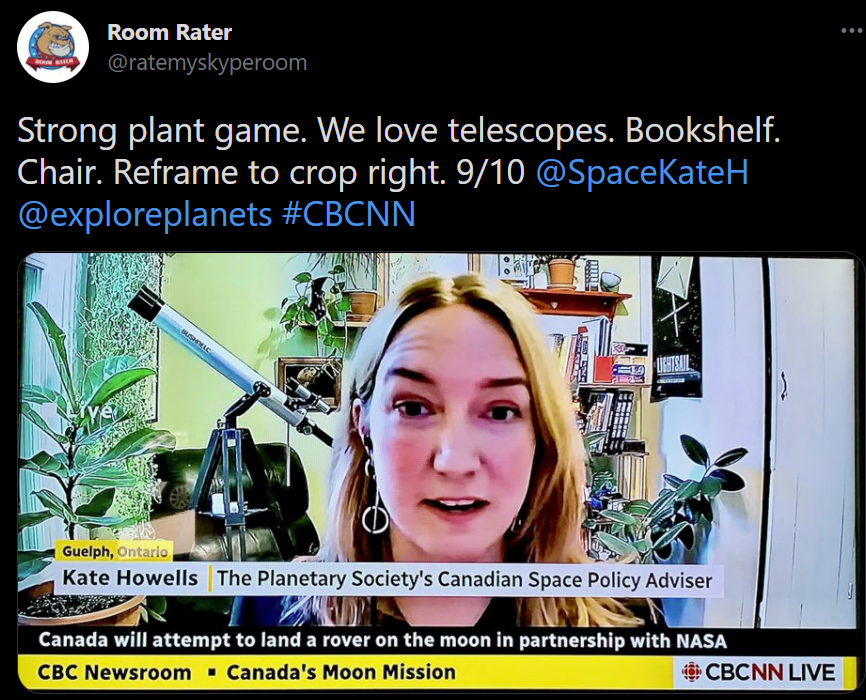
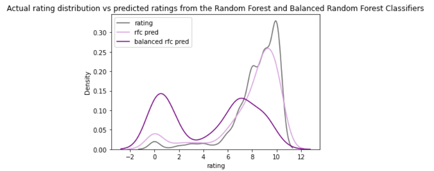

# Optimizing your web conference background with Room Rater

#### Data Science Nanodegree Capstone Project

## Project Definition

### Overview

This project predicts the quality of people's web conference backgrounds using Natural Language Processing and Machine Learning pipelines.

The models are trained and tested on tweets collected from the Room Rater (@ratemyskyperoom) Twitter account. This account posts photos of people's web conference backgrounds, critiquing the background aesthetics and assigning them a score of 0-10 out of 10.

Natural Language Processing is used to tokenize the tweet text to identify key vocabulary used in the background evaluation criteria. The tokenized text is also fed into the machine learning model, where several classifiers are tested in their ability to predict ratings.

Quick examples of Room Rater's tweets and rating style:

8/10 Background                                 | 9/10 Background
:----------------------------------------------:|:----------------------------------------------:
 | 

#### Navigation

#### Table of Contents

- [Optimizing your web conference background with Room Rater](#optimizing-your-web-conference-background-with-room-rater)
      - [Data Science Nanodegree Capstone Project](#data-science-nanodegree-capstone-project)
  - [Project Definition](#project-definition)
    - [Overview](#overview)
      - [Navigation](#navigation)
      - [Table of Contents](#table-of-contents)
        - [Files](#files)
    - [Problem Statement](#problem-statement)
    - [Metrics](#metrics)
    - [Quick start](#quick-start)
      - [Access tweets with the Twitter API](#access-tweets-with-the-twitter-api)
      - [Requirements](#requirements)
  - [Methodology](#methodology)
  - [Results](#results)
  - [Recommendations](#recommendations)
  - [Acknowledgements](#acknowledgements)

##### Files

- RoomRater.ipynb - contains code for data wrangling, NLP, models, and evaluation as well as analysis of findings along the way
- RoomRater.html - HTML version of Jupyter Notebook
- Data:
    - roomratertweets.csv (tweets collected through the Twitter API)
    - roomratertweets2.csv (additoinal tweets collected)
- Requirements.txt
- Blog post:

### Problem Statement

At the start of the COVID pandemic, professionals found themselves suddenly launched into a work-from-home situation, requiring that they attend meetings from their kitchens, living rooms, bedrooms, and if they're lucky, home offices.

Many people were not used to presenting themselves in this context, and are even less aware of how their backgrounds were a part of the impression they gave. 

Enter Room Rater. This Twitter account began posting photos of various people appearning on air, particularly reporters. They began scoring people's backgrounds, applauding them for a good use of plants and books in the background, or critiquing their lighighting situation.

One can scroll through to get an idea about what might make a good background, but what would the data say if we look at their scores systematically.

### Metrics

**Predictive variable**: Tokenized tweet text

**Outcome variable**: Rating, a multiclass variable on a 1-10 scale

**Evaluation metrics**:
To evaluate the classification models, the following metrics will be used:
- Accuracy - portion of labels accurately predicted
- Precision - the portion of predictions of a specific class that are correctly predicted (ex. how many predicted to be 9 were actually 9)
- Recall - the portion of a specific class a correctly predicted (ex. how many actual 9's were predicted to be 9)
- F1 score - the harmonic mean of precision and recall
- ROC AUC - the area under the ROC curve (true positive rate vs false positive rate), with .5 signifying the model performing on par with random classification.

Because the rating is ordinal, the above metrics don't account for the degree of misclassification. They won't recognize that misclassifying a 10 as a 9 is preferable to misclassifying a 10 as a 2. Therefore we'll also use the following data point to assess the distance from the correct value:
- Average absolute value of the difference between the actual and predicted ratings

### Quick start

#### Access tweets with the Twitter API

Resources to get you started with the Twitter API and a helpful python package for getting tweets:
- https://developer.twitter.com/en/docs/twitter-api/tweets/lookup/introduction
- https://docs.tweepy.org/en/latest/
- https://docs.tweepy.org/en/v3.10.0/cursor_tutorial.html

#### Requirements

Clone the repository and install the requirements using the script below. The project uses Python 3.8.8.

`pip install -r requirements.txt`

## Methodology

Several **Natural language processing** techniques were used to identify relevant key words:
- Removal of punctuation, URLs, and other non-text characters, as well as normalization of case
- Removal of English stop words (the, a, an)
- Word tokenization to break sentences into word tokens for analysis
- Lemmatization so that words like plants and plant can be grouped into a single token

Most common word tokens used in Room Rater's ratings:

We can tell RoomRater cares most about art in the background, followed by plants, books, and a sense of depth. After that, lighting, pillows, and flowers factor in.

We can also see how RoomRater focuses on different keywords for backgrounds of different quality. Low- to mid-rated backgrounds need work on camera angle and keeping their cords out of sight. Backgrounds in the 7-9 range have the basics down and can focus on adding elements like plants and art to enhance the decor.

Most common words by rating:

**Five classifiers were evaluated:**

- *Random Forest Classifier* (fits multipe decision tree classifiers on different sub-samples to minimize over-fitting)
- *Balanced Random Forest Classifier* (balances by employing under-sampling to the random forest classifier)
- *Gradient Boosting Classifier* (runs multiple Decision Tree classifiers to minimize the loss function)
- *Easy Ensemble Classifier* (using the AdaBoost Classifier as a base estimator, employs random under-sampling on the bootstrap samples)
- *Ordinal Logistic Regresstion* (a classifier that takes into account that the order of the ratings are meaningful)

GridSearchCV was implemented to evaluate several combinations of parameters for the classifiers.

## Results

The Random Forest Classifier was the only classifier that had an ROC AUC score above .6. With .5 signifying performance equivalent to random assignment, none of these models performed great.

In general, the balanced classifiers did not perform as well as the originals. Here's an example of the Random Forest and the Balanced Random Forest predictions in comparison with the actual ratings:

Impact of balancing on distribution of predicted ratings for the Random Forest Classifier

If the real world population is similar to the sample that RoomRater has collected, with many excellent, 10/10-worthy backgrounds, the Random Forest Classifier shows the most potential. However, if people's web backgrounds in the real world are less likely to score a 10, the balanced classifiers may be worth considering.

The Ordinal Logistic Regression didn't outperform the other classifiers, despite assigning ordinal value to the classes. However, further research could explore ordinal classification using the Random Forest or Boosting methodologies. 

See Jupyter Notebook for full evaluation of each model.

## Recommendations

*Sentiment analysis*

Adding sentiment analysis would likely improve the model. We see common words like "depth", "lighting", "reframe", but would gain more value if we could distinguish when these words are used positively or negatively.

*Parts of speech/verb form analysis*

Identifying verb type, to see whether the command form is used, would also help us identify if RoomRater is either applauding the person for effective use or if they're making a recommendation. For example, the use of the gerund in "good reframing" is positive, whereas the use of the command form in "reframe" is a suggestion for improvement.

*Deep learning and image classification*

Another data source that could enhance the model is the actual photo. A neural netowrk could be developed to identify visual similarities in what makes a 10/10 background. Like sentiment analysis, this model could help assess the quality of the lighting, placement of the decore, and position of the camera.

One could take this project further and create an app that allows users to upload a photo of their web background, and through image analysis, recommendations would be made to add plants, artwork, books, or adjust lighting and framing.

## Acknowledgements

This project was completed as a part of the Data Science Nanodegree with www.udacity.com.

